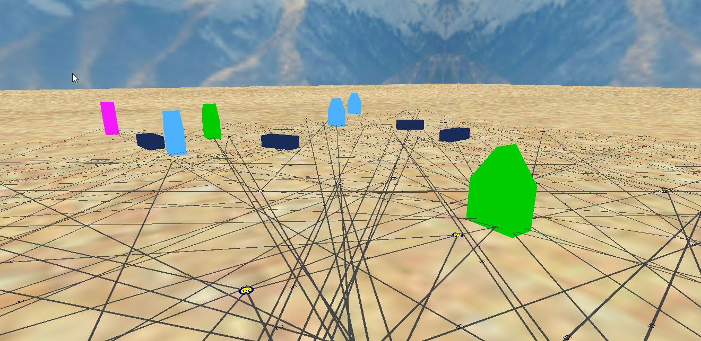

[](https://ci.appveyor.com/project/glisquery/white)
[](https://www.codacy.com/manual/makarevich.t/White?utm_source=github.com&amp;utm_medium=referral&amp;utm_content=glisquery/White&amp;utm_campaign=Badge_Grade)

[](https://bettercodehub.com/)
[](https://raw.githubusercontent.com/glisquery/White/master/LICENSE)
[](https://GitHub.com/glisquery/White/network/)
<!--- [](https://GitHub.com/glisquery/White/graphs/commit-activity) --->
<!--- [comment]: [](https://GitHub.com/glisquery/White/pulls/) --->
# Wargaming Forge 2019 Project
## Game Client
### White Team
- [Dmitry Lisay](https://github.com/403)
- [Dmitry Sipeyko](https://github.com/MintaiDS)
- [Taras Makarevich](https://github.com/glisquery)
### Short description
An educational project of the simple game client. 
A game is built with a simple game engine
including graphics, networking and input system.
<details>
<summary>Development status</summary>
Train displaying and update implemented.

</details>
### Building instructions 
#### On Windows
##### Build project in one step
- Build using CMake.
```batch
build 
```
##### Manual building
- Perform all building steps manually.
```batch
cmake -E make_directory Build Build/Bin Build/Obj
cd Build
cmake ../Source
cd ..
cmake --build Build
```
### Running application
- Pass username as a command line argument to the run script.
```batch
 run <username>
```
### Keyboard controls
- WASD - moving in four directions.
- Space - move up.
- Control - move down.
- Hold left button and mouse move - rotate camera.
